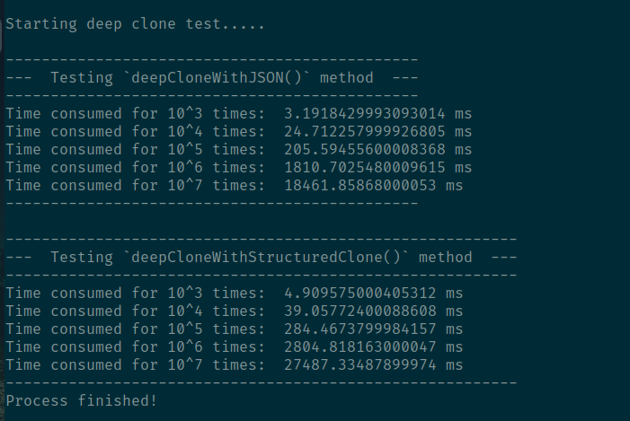
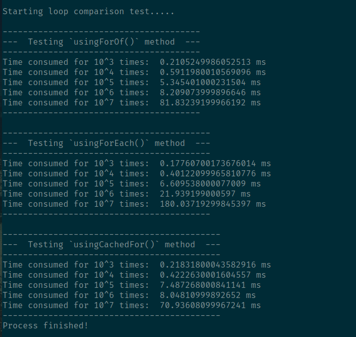
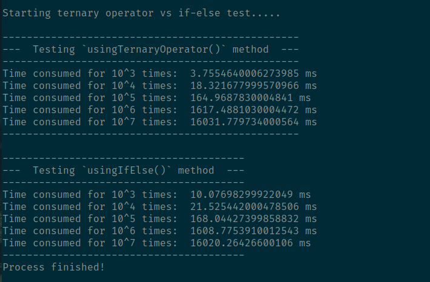
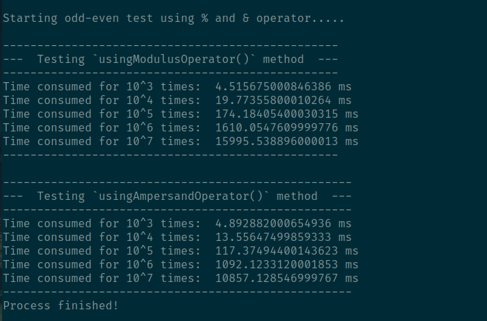
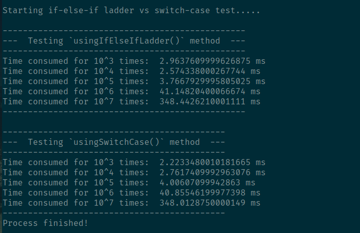
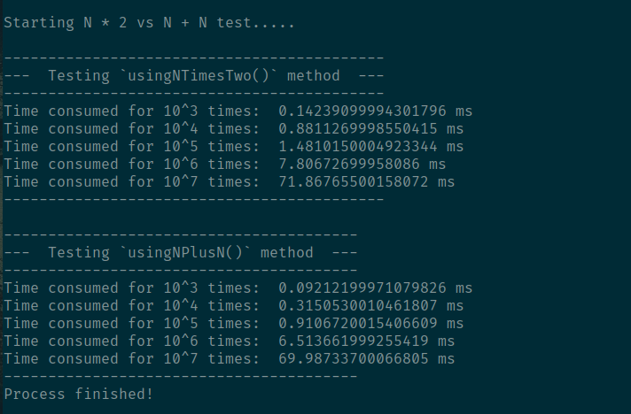

  
  <h1>JavaScript Benchmark Testing</h1>

Welcome to the **JavaScript Benchmark Testing** repository! This collection of benchmarks aims to provide in-depth insights into the performance characteristics of various JavaScript operations. Whether you're optimizing code for speed or simply curious about the efficiency of different approaches, these benchmarks offer valuable information.

> [!NOTE]
> The testing results may vary based on your device. I conducted a series of tests on my own device, a Lenovo X1 Yoga with a Core i7 8th gen processor, 512 GB SSD, and 16 GB RAM, and have included the corresponding screenshots of the results for your reference. Keep in mind that different device configurations could yield different outcomes, so it's advisable to run the tests on your specific hardware for accurate comparisons.

## Running the Benchmarks

To run the benchmarks locally, follow these steps:

1. **Clone this repository**: `git clone https://github.com/tajnur007/js-benchmark-testing.git`
2. **Navigate to the repository**: `cd js-benchmark-testing`
3. **Run the benchmark tests**: `npm run benchmark`

## Table of Contents

- [Object Deep Clone Comparison](#object-deep-clone-comparison)
- [Loops Comparison](#loops-comparison)
- [Condition Check Comparison](#condition-check-comparison)
- [Odd-Even Comparison](#odd-even-comparison)
- [If-Else-If Ladder vs Switch-Case](#if-else-if-ladder-vs-switch-case)
- [N * 2 vs N + N Comparison](#n--2-vs-n--n-comparison)

## Object Deep Clone Comparison

This section compares two prevalent methods for deep cloning objects in JavaScript: utilizing `JSON.parse` and employing the `structuredClone` approach. Explore the benchmarks to understand the performance trade-offs and choose the optimal method for your use case. [Check code](./tests/deep-clone.js)

  

## Loops Comparison

Delve into the world of loops with benchmarks comparing `for-of`, `for-each`, and a cached `for` loop. Uncover the nuances of each loop construct and discover the most efficient solution for your iteration needs. [Check code](./tests/for-loop-comparison.js)

  

## Condition Check Comparison

Compare the performance of the ternary operator against `if-else` statements in this section. Gain insights into the impact on execution speed, helping you make informed decisions when structuring your conditional logic. [Check code](./tests/ternary-operator-vs-if-else.js)

  

## Odd-Even Comparison

Dive into the realm of bitwise operations with benchmarks comparing the `%` (modulo) operator and the `&` (bitwise AND) operator for determining odd and even numbers. Explore the performance characteristics of each method and optimize your numeric checks. [Check code](./tests/odd-even-comparison.js)

  

## If-Else-If Ladder vs Switch-Case

Explore benchmarks comparing the performance of `if-else-if` ladders against `switch-case` constructs. Uncover the efficiency of each approach, empowering you to choose the best construct for your complex branching logic. [Check code](./tests/if-else-if-vs-switch-case.js)

  

## N * 2 vs N + N Comparison

Discover the performance nuances between multiplying a number by 2 (`N * 2`) and adding the number to itself (`N + N`). Gain insights into the arithmetic operations that suit your numerical manipulations best. [Check code](./tests/n-times-two-vs-n-plus-n.js)

  

## Further Improvements

- Include additional benchmark comparisons.
- Allow users to customize the benchmarks.
- Add detailed explanations of the benchmarks.
- Integrate with continuous integration tools.

## Conclusion

This repository provides a valuable resource for understanding the performance of common JavaScript operations. The benchmark results can help developers make informed decisions about which methods to use for optimal performance in their applications.

Thanks for joining the JavaScript Benchmark Testing Repository journey! Your involvement and contributions are appreciated. If you found this repository useful, consider giving it a star. Let's keep in touch as the project evolves—share your thoughts via email at <a href='mailto:tajnur007@gmail.com' target='_blank'>tajnur007@gmail.com</a>. Your enthusiasm and support make a difference in the open-source community. Happy coding!

## Contributing

Your contributions are highly welcome! If you discover additional comparisons or want to enhance existing benchmarks, please follow the [contribution guidelines](CONTRIBUTING.md).

## License

This repository is licensed under the MIT License - see the [LICENSE](LICENSE) file for details.
